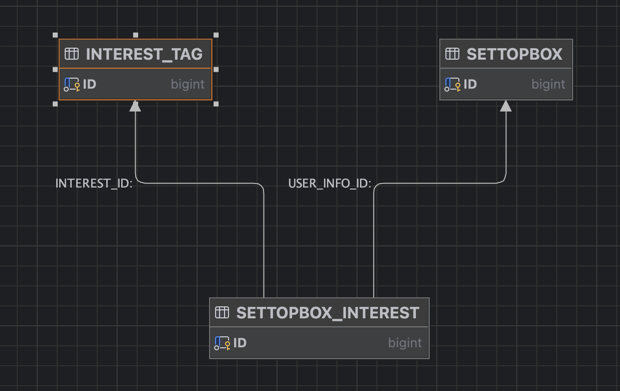
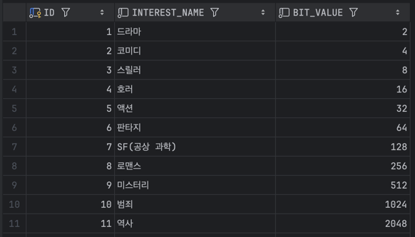
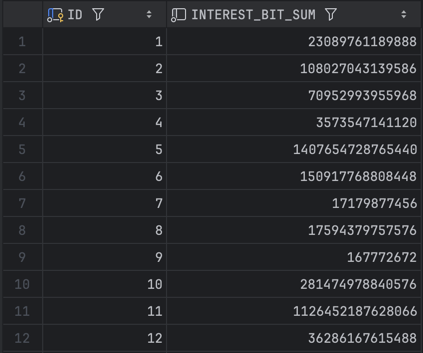

# 비트마스킹을 통한 데이터 관리

고객사로부터 셋탑박스의 이전 달 송출 기록을 기반으로 특정 장르나 관심사와 관련된 프로그램을 시청한 셋탑박스의 수를 실시간으로 조회하는 기능 개발을 요청받았습니다. 
약 1000만에 달하는 셋탑박스와 다양한 프로그램 장르 및 관심사의 수로 인해 복잡한 작업이 예상되었습니다.

## 일반적인 1:N 관계에서의 조회

하나의 셋탑박스에 연결된 TV는 여러 장르의 프로그램을 시청할 수 있으며, 이는 셋탑박스와 시청 프로그램 장르가 1:N의 관계를 형성하고 있습니다.



위 테이블에서 특정 장르를 시청한 셋탑박스 수를 조회하기 위해 아래와 같은 일반적인 조인 쿼리를 사용했습니다.

```sql
SELECT COUNT(DISTINCT S.ID)
FROM SETTOPBOX S
INNER JOIN SETTOPBOX_INTEREST SI ON S.ID = SI.USER_INFO_ID
WHERE SI.INTEREST_ID IN (1, 2, 3);
```

이 쿼리의 실행에는 약 17초가 소요되었으며, IN 절에 포함된 조건이 늘어날수록 실행 시간이 1분을 초과하기도 했습니다.
데이터 수가 많고 중복 제거 때문에 빠른 처리 시간을 기대하기 어려워, 새로운 방법의 검토가 필요했습니다. 이에 대해 고민하던 중 고객사 담당자께서
비트마스킹 기법을 제안하셨습니다.

## 비트마스킹 (Bit Masking)
비트마스킹은 이진수 비트를 조작해 특정 비트를 설정, 해제, 확인하는 기법입니다.
메모리나 성능이 중요한 시스템에서 효율적으로 데이터를 저장·전송할 때 주로 사용됩니다.

## 비트마스킹을 통한 셋탑박스의 시청 장르/관심사 관리

### OR 연산을 통한 목록 관리

비트마스킹으로 목록을 관리하기 위해 각 목록에 고유 비트값을 부여합니다. 비트 자리는 각 목록을 나타내며, 여러 목록을 포함할 때는 OR 연산을 사용합니다.

```sql
-- 드라마 : 0b00000001
-- 코미디 : 0b00000010
-- 스릴러 : 0b00000100

-- 드라마 | 스릴러 : 0b00000001 | 0b00000100 = 0b00000101
```

- 2의 제곱수는 하나의 1인 비트를 가지는 값을 의미합니다.
  
- 각 셋탑박스에 드라마/관심사 목록의 비트값을 OR 연산한 결과를 저장합니다.
  *저장된 값은 2의 제곱수들의 합*

### AND 연산을 통한 포함 여부 확인

비트마스킹을 통해 특정 목록의 포함 여부를 확인하려면 AND 연산을 사용합니다.

```sql
-- 드라마 : 0b00000001
-- 코미디 : 0b00000010
-- 스릴러 : 0b00000100
-- 드라마 | 스릴러 : 0b00000101
-- 드라마 | 코미디 : 0b00000011
    
-- (드라마 | 스릴러) & 드라마 = 0b00000101 & 0b00000001 -> 드라마 포함
-- (드라마 | 스릴러) & 코미디 = 0b00000101 & 0b00000010 -> 코미디 미포함

-- 하나의 장르라도 시청한 셋탑박스의 수
SELECT COUNT(1)
FROM SETTOPBOX
WHERE BITAND(
    INTEREST_BIT_SUM,
    (
        SELECT CAST(SUM(INTEREST_TAG.BIT_VALUE) AS BIGINT) AS BIT_SUM
        FROM INTEREST_TAG
        WHERE ID IN (1, 2, 3)
    )
) > 0;
```

쿼리 실행 결과 IN 절 조건에 관계없이 2~3초 내에 처리되었습니다. 또한, 시청 프로그램 장르 목록을 하나의 컬럼에서 관리하여 데이터 용량 면에서도 효율적이었습니다.

## 마치며

비트마스킹을 적용하면 데이터를 효율적으로 관리하고 조회 속도를 개선할 수 있었습니다. 다만, 항상 비트마스킹이 최선의 선택은 아닙니다. 
특히 DB에서의 데이터 관리 측면에서는 FK를 통한 명확한 관계 설정이 중요하다면 비트마스킹이 아닌 다른 방법을 찾아야 할 것입니다.

